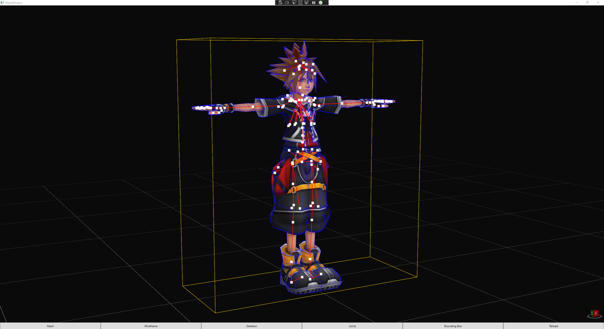

# Modeling Toolkit

Modeling Toolkit is a library used to load 3d model data in a simple way and be able to make common operations such as euler to/from quaternion conversion and generating triangle strips.

The models can be visualized as well as imported and exported in common formats (ModelingToolkit.Core can be used to load custom data)

## Packages

| Package | Description |
| - | :- |
| [ModelingToolkit](https://github.com/osdanova/ModelingToolkit) | A tool to process and display 3D models. A sample app that uses Formats and Core |
| [ModelingToolkit.Formats](https://github.com/osdanova/ModelingToolkit.Formats) | An extension of core that supports importing and exporting using other formats |
| [ModelingToolkit.Core](https://github.com/osdanova/ModelingToolkit.Core) | The very basic platform agnostic objects to work with 3D models |

### Currently supported formats:

| Format | Export | Import |
| :- | :-: | :-: |
| GLTF | Model | - |
| FBX | Model | Model |

## Dependencies

* ModelingToolkit.Formats
* ModelingToolkit.Core
* [SharpGLTF.Toolkit - 1.0.1](https://github.com/vpenades/SharpGLTF)
* [AssimpNet - 5.0.0-beta1](https://bitbucket.org/Starnick/assimpnet/src/master/)
* [HelixToolkit.Wpf](https://github.com/helix-toolkit/helix-toolkit)